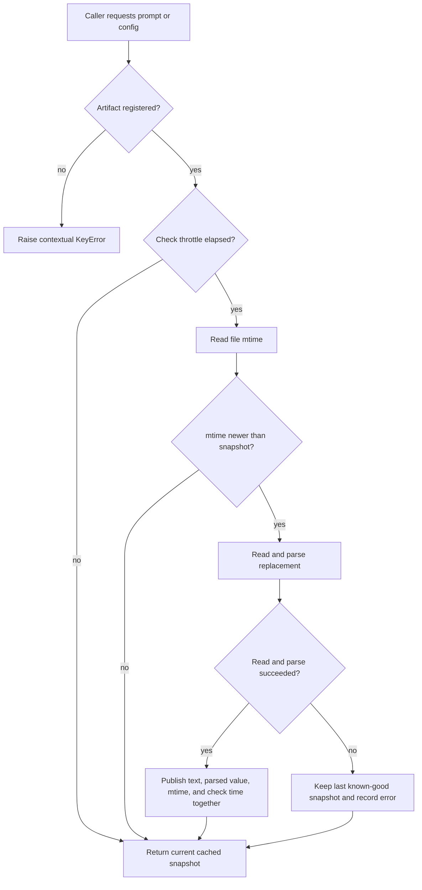

# Hot-reload behavior

Hot-reload lets a running aide-de-camp process pick up edits to prompts and
configuration without restarting the server. There are three related loaders;
they all publish a complete in-memory snapshot only after the replacement has
been read and validated.

## At a glance

| Artifact | Loader | Normal trigger | Immediate trigger | Published value |
| --- | --- | --- | --- | --- |
| `prompts/*.md`, `config/monitoring.yaml`, and other registered artifacts | `HotReloadManager` in `src/components/hot_reload.py` | A later read sees a newer mtime, after the one-second check throttle | `force_reload(name)` | Text for prompts; parsed YAML/JSON for configs |
| `config/registry.yaml` used by intent routing | `src/registry.py` | The five-minute `CACHE_TTL` expires | `get_registry(force=True)` | Validated registry merged with discovered projects |
| `config/monitoring.yaml` used by ambient monitoring | `ConfigLoader` in `src/monitoring/config_loader.py` | A later async read sees a newer mtime | `get_config(force_reload=True)` or `invalidate_cache()` | Parsed monitoring mapping and its tick interval |

The application-level singleton registers these built-in artifacts during
`get_reload_manager()` initialization:

```text
prompts/router.md       prompts/synthesize.md   prompts/voice.md
prompts/urgency.md      prompts/fetch/status.md prompts/fetch/action.md
config/registry.yaml    config/monitoring.yaml  config/exceptions.yaml
```

## What happens on an access

The normal `HotReloadManager` path is:



Registration reads and validates the initial file immediately. Subsequent
`get_prompt()` and `get_config()` calls are cheap cache reads unless the
change-detection path is eligible to run. The manager's `CHECK_INTERVAL` is
one second: an edit made immediately after a check can remain invisible until
the next eligible access. This is a deliberate I/O throttle, not a loss of the
edit. Tests that need deterministic immediate behavior use `force_reload()`.

The registry loader is separate. `get_registry()` returns the in-process
snapshot for five minutes, then rebuilds it from YAML and repository discovery.
`get_registry(force=True)` bypasses that TTL. YAML entries take precedence over
auto-discovered entries, and schema validation completes before the new
snapshot replaces the old one.

The monitoring loader also has its own cache. Its async `get_config()` compares
the file mtime and updates the configured ambient-monitor tick interval after a
successful reload. It does not share the registry cache or the prompt manager's
throttle state.

The router deliberately loads only `prompts/router.md` on its latency-sensitive
classification path. `prompts/urgency.md` is still registered and hot-reloaded
for synthesis, but an urgency-only edit does not change the router system
prompt. This is an intentional side effect of the router latency optimization,
not a missed reload.

## Side effects and failure behavior

Hot-reload changes process-local state. A successful reload:

- changes what the next prompt-building, routing, synthesis, fetch, or
  monitoring invocation sees;
- does not restart Uvicorn, recreate the process, or write the source file;
- updates the cached parsed value and the artifact mtime atomically from the
  reader's point of view; and
- may cause a registry lookup, router decision, synthesized urgency, or
  monitoring interval to differ on the next invocation.

The manager protects its artifact map and cache with an `RLock`. File reads,
mtime checks, and parsing retry transient filesystem failures up to the
configured retry limit. Every public manager operation has a bounded four-second
operation budget (`FILE_OPERATION_TIMEOUT`, capped below five seconds). A
blocked filesystem or parser raises `HotReloadTimeoutError` with the path,
operation, reason, and remediation instead of hanging the request or test.

Replacement publication is intentionally all-or-nothing:

- A missing, unreadable, empty, or malformed replacement does not overwrite the
  last known-good manager snapshot. The error is stored on the artifact and
  logged; ordinary change checks return the old value.
- `force_reload()` raises its read/parse error to the caller and likewise does
  not publish a partial replacement.
- Repeated manager failures are counted. Prompt access becomes a contextual
  `RuntimeError` after more than five recent load errors, prompting the caller
  to fix the file or filesystem rather than silently using a broken source.
- The registry rebuild rejects invalid schema before publishing. Its
  process-wide lock prevents concurrent readers from observing a partially
  rebuilt registry.

## Cleanup and idempotency

The production loader does not create temporary files and does not clean up or
rewrite artifacts as part of a reload. Cleanup is a test responsibility:

- Prompt, urgency, monitoring, and edge-case tests use `tmp_path` or temporary
  files, with fixture teardown or `finally` blocks removing them.
- Tests that exercise the repository's real `config/registry.yaml`,
  `prompts/router.md`, or `prompts/synthesize.md` capture the original bytes,
  restore them in teardown, and refresh the relevant in-memory cache afterward.
- `tests/test_config_hot_reload.py` provides the reusable `backup_registry`
  fixture. It restores the registry even when an assertion fails. The registry
  infrastructure fixtures additionally remove only their own timestamped
  backup files and make repeated cleanup safe.
- The standalone dispatch smoke tests restore edited files in `finally` blocks.
  They require a running server and are therefore separate from the isolated
  in-process CI command described below.

The supported idempotency guarantee is observational: reading an unchanged
artifact repeatedly, or forcing the same unchanged artifact to reload
repeatedly, returns equivalent content and does not add artifacts, leak file
handles, or accumulate temporary files. Concurrent readers are serialized by
the manager/registry locks. A reload is not a transaction across multiple
different files, however; if two files are edited, each becomes visible when
its own loader next checks it.

## Test and CI/CD integration

Pytest is the repository's test suite. `pytest.ini` selects `tests/`,
`test_*.py`, and `test_*` functions, so the hot-reload modules are already part
of the suite without a separate registration list. The suite currently
contains unit, integration, edge-case, timeout, concurrency, cleanup, and
idempotency coverage, including:

```text
tests/test_config_hot_reload.py
tests/test_hot_reload*.py
tests/test_registry_hot_reload*.py
tests/test_router_prompt_hotreload.py
tests/test_urgency_hotreload.py
tests/test_monitoring_config_hotreload.py
tests/intent/test_hot_reload.py
```

For a bounded, isolated run of the in-process coverage, use:

```bash
./scripts/run_hot_reload_tests.sh
```

The script uses a 120-second suite budget and the production loader's
four-second per-operation budget. It runs tests serially so repository-file
backup/restore fixtures cannot race one another. The network-backed
`tests/test_hot_reload_dispatch.py` module is intentionally opt-in because it
requires a live server:

```bash
RUN_DISPATCH_E2E=1 ./scripts/run_hot_reload_tests.sh
```

No CI workflow (GitHub Actions, Forgejo Actions, GitLab CI, tox, or nox) is
currently configured in this repository, and the README identifies the
project as source-run. Consequently there is no remote CI job whose result can
be reported for this change. The script is the stable command for a future
Forgejo CI job; until such a runner exists, a passing local invocation is
verification of the same pytest command, not a claim of remote CI execution.

When a CI runner is added, it should install `.[dev]`, run the script from the
repository root, preserve the serial execution, and set
`RUN_DISPATCH_E2E=1` only in a job that starts the application and provides an
isolated database/session. No deployment or live cluster is needed for the
in-process hot-reload tests.

## Useful commands

```bash
# All tests discovered by pytest
python -m pytest

# Hot-reload tests only, without the external dispatch smoke test
./scripts/run_hot_reload_tests.sh

# One focused regression
python -m pytest tests/test_router_prompt_hotreload.py -q
python -m pytest tests/test_hot_reload_fail_fast.py -q
```

If a change is not visible, first check whether the one-second manager throttle
or five-minute registry TTL is in effect. Use the appropriate force/invalidate
API for a deterministic check, then inspect the contextual exception and the
artifact's source path before changing deployment state.
